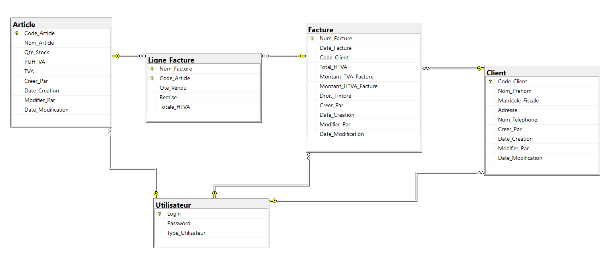

# 📋 Invoice Management

**Invoice Management** is a professional .NET Framework Windows Forms application designed to streamline invoice creation, management, and user handling. Built for small businesses or personal use, it offers an intuitive interface for data entry and user administration.

## 🚀 Overview
This project showcases a robust solution for managing invoices, including features for adding, viewing, and editing invoice details, along with user authentication and management capabilities.

## 📊 Database Diagram
Below is a visual representation of the database schema:


## ✨ Features
- 📝 **Invoice Creation**: Easily create and edit invoices with a user-friendly interface.
- 👤 **User Management**: Add, view, and manage users with secure access.
- 🔒 **Authentication**: Simple login system to protect sensitive data.
- 💾 **Data Persistence**: Stores data locally (requires setup with a database like SQL Server).
- 🎨 **Modern UI**: Clean and responsive design using Windows Forms.

## 🛠️ Technologies Used
- **Language**: C# (.NET Framework)
- **Framework**: Windows Forms
- **Database**: SQL Server (configurable)
- **IDE**: Visual Studio (for development)

## 📋 Prerequisites
- **Windows OS** with .NET Framework 4.5 or higher installed.
- **Visual Studio**: Recommended for opening and building the project (Community edition is free).
- **SQL Server**: For database setup (e.g., SQL Server Express).
- **Git**: For version control and cloning the repository.

## 🚀 Getting Started
### Installation
1. Clone the repository:
   ```bash
   git clone https://github.com/KhalilAmamri/InvoiceManagement.git
   cd InvoiceManagement

Open the project in Visual Studio.
Configure the database connection (update connection string in connect_db.cs if applicable).
Build and run the solution.

Database Setup

Install SQL Server (e.g., SQL Server Express) and SQL Server Management Studio (SSMS).
Open SSMS and connect to your SQL Server instance (e.g., .\SQLEXPRESS).
Run the SQL script located in Database/database.sql to create the database and tables:

In SSMS, open Database/database.sql and click Execute.
Or, use the command line:
bashsqlcmd -S .\SQLEXPRESS -i Database/database.sql


Update the connection string in connect_db.cs to point to your database. Example:
csharpstring connectionString = "Data Source=.\SQLEXPRESS;Initial Catalog=DB_GestionFacture;Integrated Security=True";

Note: Adjust the file paths in the script (e.g., FILENAME for .mdf and .ldf) to match your SQL Server data directory if needed.

Running the Application

Open main.cs or the startup form in Visual Studio.
Press F5 to build and run.

📂 Project Structure
textInvoiceManagement/
├── Database/
│   └── database.sql           # SQL script to create the database and tables
├── images/
│   └── database_diagram.png   # Database schema diagram
├── FormGestionFactures.cs     # Invoice management form
├── FormGestionFactures.Designer.cs
├── FormGestionFactures.resx
├── FormLogin.cs               # Login form
├── FormLogin.Designer.cs
├── FormLogin.resx
├── connect_db.cs              # Database connection logic
├── main.cs                    # Application entry point
├── .gitignore                 # Git ignore file
└── README.md                  # This file
🤝 Contributing
We welcome contributions! To contribute:

Fork the repository.
Create a feature branch: git checkout -b feature/new-feature.
Commit your changes: git commit -m "Add new feature".
Push to the branch: git push origin feature/new-feature.
Open a Pull Request.

📄 License
This project is licensed under the MIT License - see the LICENSE file for details.
👤 Author

Developed by: [Khalil Amamri]
GitHub: KhalilAmamri

🙌 Acknowledgments

Inspired by .NET Framework community resources.
Thanks to all contributors and users!
