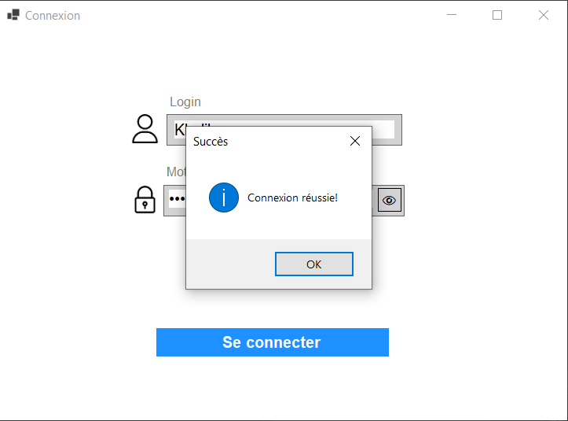
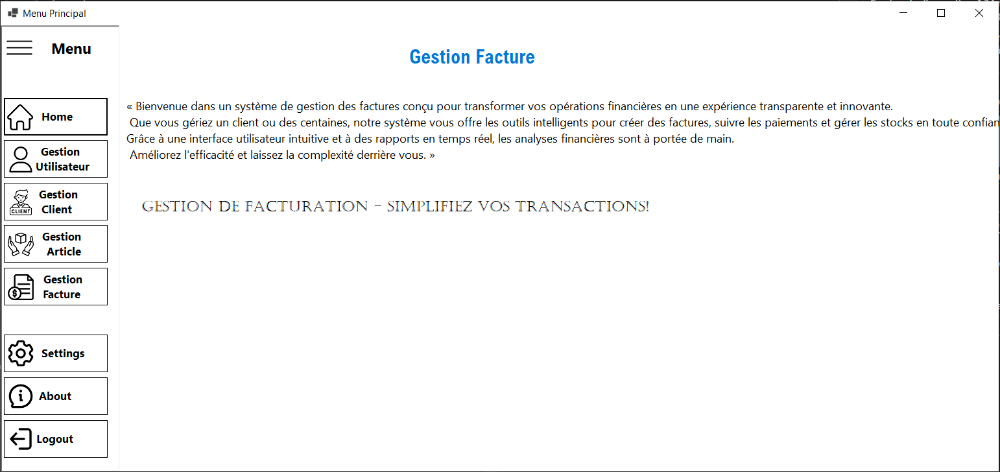
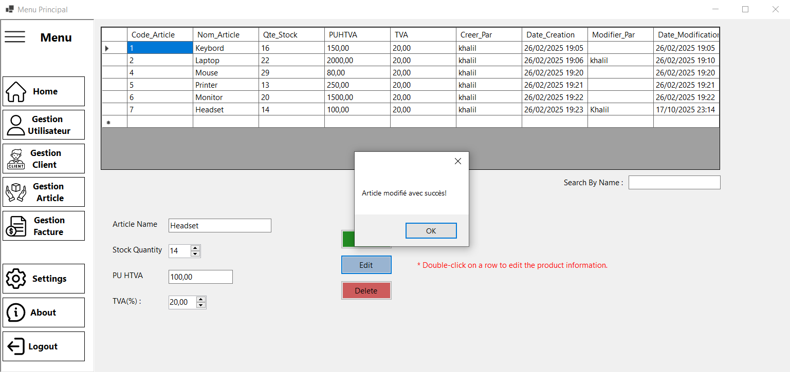
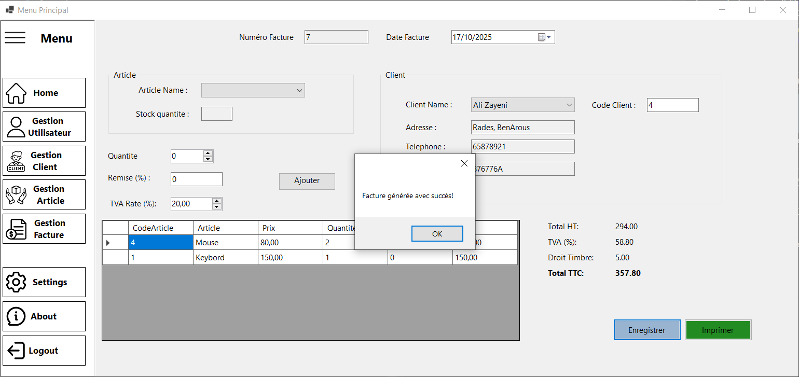
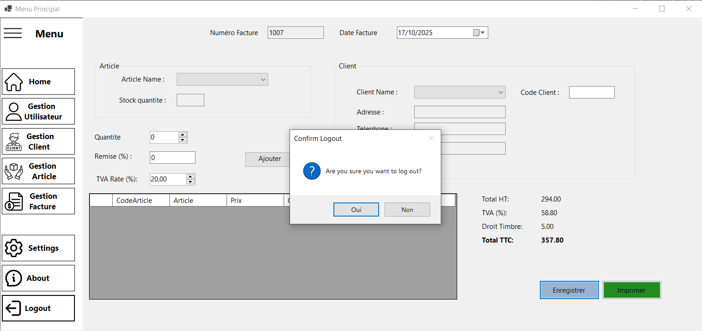

# 📋 Invoice Management

**Invoice Management** is a professional .NET Framework Windows Forms application designed to streamline invoice creation, management, and user handling. Built for small businesses or personal use, it offers an intuitive interface for data entry and user administration.

---

## 🚀 Overview
This project provides a robust solution for managing invoices, including features for adding, viewing, and editing invoice details, along with user authentication and management capabilities.
---

---

---

---

---

---

---

---

## 📊 Database Diagram
Below is a visual representation of the database schema:


---

## ✨ Features
- 📝 **Invoice Creation**: Easily create and edit invoices with a user-friendly interface.  
- 👤 **User Management**: Add, view, and manage users with secure access.  
- 🔒 **Authentication**: Simple login system to protect sensitive data.  
- 💾 **Data Persistence**: Stores data locally (requires setup with a database like SQL Server).  
- 🎨 **Modern UI**: Clean and responsive design using Windows Forms.  

---

## 🛠️ Technologies Used
- **Language**: C# (.NET Framework)  
- **Framework**: Windows Forms  
- **Database**: SQL Server (configurable)  
- **IDE**: Visual Studio  

---

## 📋 Prerequisites
Before running the project, make sure you have the following installed:  

- **Windows OS** with .NET Framework 4.5 or higher.  
- **Visual Studio** (Community Edition recommended).  
- **SQL Server** (e.g., SQL Server Express).  
- **Git** for version control and cloning the repository.  

---

## 🚀 Getting Started

### Installation
1. Clone the repository:  
    ```bash
    git clone https://github.com/KhalilAmamri/InvoiceManagement.git
    cd InvoiceManagement
    ```
2. Open the project in Visual Studio.  
3. Configure the database connection in `connect_db.cs` if needed.  
4. Build and run the solution.  

### Database Setup
1. Install SQL Server (e.g., SQL Server Express) and SQL Server Management Studio (SSMS).  
2. Open SSMS and connect to your SQL Server instance (e.g., `.\SQLEXPRESS`).  
3. Run the SQL script to create the database and tables:  
    ```bash
    sqlcmd -S .\SQLEXPRESS -i Database/database.sql
    ```
   Or open `Database/database.sql` in SSMS and click **Execute**.  
4. Update the connection string in `connect_db.cs`:  
    ```csharp
    string connectionString = "Data Source=.\\SQLEXPRESS;Initial Catalog=DB_GestionFacture;Integrated Security=True";
    ```
> **Note:** Adjust file paths in the script (`.mdf` and `.ldf`) if needed to match your SQL Server data directory.  

### Running the Application
1. Open `main.cs` or the startup form in Visual Studio.  
2. Press **F5** to build and run the project.  

```

## 📂 Project Structure
InvoiceManagement/
├── Database/
│ └── database.sql # SQL script to create the database and tables
├── images/
│ └── database_diagram.png # Database schema diagram
├── FormGestionFactures.cs # Invoice management form
├── FormGestionFactures.Designer.cs
├── FormGestionFactures.resx
├── FormLogin.cs # Login form
├── FormLogin.Designer.cs
├── FormLogin.resx
├── connect_db.cs # Database connection logic
├── main.cs # Application entry point
├── .gitignore # Git ignore file
└── README.md # This file

```
---

## 🤝 Contributing
We welcome contributions! To contribute:

1. Fork the repository.  
2. Create a feature branch:  
    ```bash
    git checkout -b feature/new-feature
    ```
3. Commit your changes:  
    ```bash
    git commit -m "Add new feature"
    ```
4. Push to the branch:  
    ```bash
    git push origin feature/new-feature
    ```
5. Open a Pull Request.  

---

## 📄 License
This project is licensed under the MIT License. See the [LICENSE](LICENSE) file for details.  

---

## 👤 Author
- **Khalil Amamri**  
- GitHub: [KhalilAmamri](https://github.com/KhalilAmamri)  

---

## 🙌 Acknowledgments
- Inspired by .NET Framework community resources.  
- Thanks to all contributors and users!


